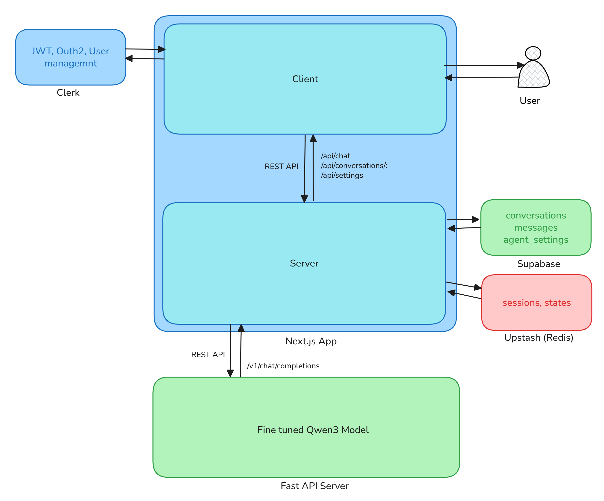

# Fine-Tuning an Open-Source LLM and Connecting It to a Full-Stack Chat Agent

> **Disclaimer:** This is a 100% educational project. The goal is to learn and gain hands-on experience with two specific things: how to fine-tune an open-source LLM using a dataset, and how to wire that model to an agent through an API. Nothing here is production-ready in the "ship to real users" sense — it's a learning lab.

---

## Why Build This?

Reading papers and watching tutorials about fine-tuning LLMs will only get you so far. At some point you have to get your hands dirty — pick a model, find a dataset, run the training loop, watch it fail, fix it, and then actually *use* the result in something real.

That's exactly what this project is. I wanted to answer two questions through building:

1. **How does fine-tuning an open-source LLM actually work?** Not conceptually — literally: what does the process look like end to end, from dataset to a hosted model on HuggingFace?
2. **How do you connect a self-hosted model to an agent application?** The fine-tuned model sitting in HuggingFace doesn't do much on its own. How do you serve it behind an API, and how does a real chat UI consume it?

An AI companion app turned out to be a perfect vehicle. It's a domain where personality matters — which gives fine-tuning a clear, measurable goal — and it's complex enough to build a real system around.

---

## The High-Level Picture

The project has two independent services that work together:



**Service 1 — The Inference Server (`finetune-model/`):** A Python FastAPI server that loads the fine-tuned Qwen3 model from HuggingFace and exposes an OpenAI-compatible `/v1/chat/completions` endpoint. It handles token streaming via SSE, accepts generation parameters, and caches the model locally after the first download.

**Service 2 — The Chat App (`chat-app/`):** A Next.js 16 application that provides the full user-facing experience: authentication, conversation management, a streaming chat interface, agent personalization settings, and a rolling summarization pipeline that gives the model long-term memory.

The two services are decoupled by a simple HTTP contract — the chat app treats the inference server exactly like it would the OpenAI API, which means swapping the model out later requires zero changes to the frontend code.

---

## Part 1: Fine-Tuning Qwen3

### Picking the Base Model

[Qwen3](https://huggingface.co/Qwen) is Alibaba's open-weight model family. The reasons for picking it were practical: it's performant on consumer hardware, has a well-documented chat template, supports the `enable_thinking=False` flag to keep responses concise, and the smaller variants fit within reasonable VRAM limits for fine-tuning.

### The Dataset

The training dataset was a curated collection of conversational samples formatted as instruction-response pairs — the kind of warm, personal, emotionally-aware exchanges you'd want from an AI companion. The data was structured in the standard chat format:

```json
{
  "messages": [
    { "role": "system", "content": "You are a caring and attentive AI companion." },
    { "role": "user",   "content": "I had a really rough day at work." },
    { "role": "assistant", "content": "I'm sorry to hear that. What happened?" }
  ]
}
```

The key insight here is that fine-tuning isn't magic — it's supervised learning. The model learns to mimic the distribution of your dataset. If your dataset has good examples of the persona you want, the model picks it up. If it doesn't, no amount of training fixes that.

### Training and Publishing

Training was done using [Unsloth](https://github.com/unslothai/unsloth) with LoRA adapters, which dramatically reduces VRAM usage by training only a small set of adapter weights instead of the full model. After training and merging the adapters back into the base model, the result was pushed to HuggingFace as a public model:

**[`nadil-dulnidu/ai-girlfriend-Qwen3-finetuned-model`](https://huggingface.co/nadil-dulnidu/ai-girlfriend-Qwen3-finetuned-model)**

Once it's there, it's just a model ID. Any code that knows how to call `from_pretrained()` can use it.

---

## Part 2: The Inference Server

The model on HuggingFace doesn't serve itself. You need a server that loads it, exposes it over HTTP, and handles the translation between "raw transformer generation" and the message format the chat app expects.

### Why FastAPI + OpenAI-Compatible API?

The decision to build an OpenAI-compatible endpoint (`POST /v1/chat/completions`) was deliberate. The [Vercel AI SDK](https://sdk.vercel.ai/) — used in the chat app — has a built-in `@ai-sdk/openai-compatible` provider. This means the chat app can point at the inference server using the same interface it would use with OpenAI, Anthropic, or any other hosted provider.

```python
# finetune-model/app/routes/openai_compat.py

@router.post("/chat/completions")
async def chat_completions(request: Request, body: ChatCompletionRequest):
    prompt = _build_prompt_from_messages(
        body.messages, tokenizer, system_prompt
    )

    if body.stream:
        return StreamingResponse(
            _stream_tokens(model, tokenizer, prompt, ...),
            media_type="text/event-stream",
        )

    response_text, prompt_tokens, completion_tokens = _generate_non_streaming(
        model, tokenizer, prompt, ...
    )
    return ChatCompletionResponse(...)
```

### Model Loading and Local Caching

The server loads the model from HuggingFace on first startup and caches it locally. Every subsequent restart uses the local copy — which makes iteration much faster.

```python
# finetune-model/app/model.py

def load_model(model_id: str):
    dtype = torch.float16 if torch.cuda.is_available() else torch.float32

    if local_path.exists() and any(local_path.iterdir()):
        source = str(local_path)   # use local cache
    else:
        source = model_id          # download from HuggingFace

    model = AutoModelForCausalLM.from_pretrained(
        source, torch_dtype=dtype, device_map="auto"
    )
    model.eval()

    if source == model_id:
        model.save_pretrained(local_path)   # cache for next time
    
    return model, tokenizer
```

### Token Streaming via SSE

Streaming responses back token-by-token is handled using Hugging Face's `TextIteratorStreamer`. It runs `model.generate()` in a background thread and yields tokens to the async generator as they're produced.

```python
streamer = TextIteratorStreamer(tokenizer, skip_prompt=True, skip_special_tokens=True)

thread = threading.Thread(target=model.generate, kwargs={**inputs, "streamer": streamer})
thread.start()

for token in streamer:
    yield f"data: {json.dumps({'choices': [{'delta': {'content': token}}]})}\n\n"
```

### Configuration

All generation parameters — `max_new_tokens`, `temperature`, `top_p`, `repetition_penalty` — live in a single `config.json`. No environment variables scattered across files, no magic constants buried in code.

```json
{
  "model": { "model_id": "nadil-dulnidu/ai-girlfriend-Qwen3-finetuned-model" },
  "generation": {
    "max_new_tokens": 128,
    "temperature": 0.6,
    "top_p": 0.9,
    "repetition_penalty": 1.1
  }
}
```

### Running the Server

```bash
# Install dependencies (uv is the package manager)
uv sync

# Start the server — model downloads on first run
uv run python server.py
```

The server starts at `http://localhost:8000`. Hit `/health` to confirm the model loaded and check which device it's running on.

---

## Part 3: The Chat Application

With the inference server running, the next job is building something people can actually use to talk to it. This is where the bulk of the "agent" work lives — message persistence, memory management, streaming UI, and user personalization.

### The Stack

| Layer | Technology |
|---|---|
| Framework | Next.js 16 (App Router) |
| UI | React 19, Tailwind CSS v4, shadcn/ui |
| AI SDK | Vercel AI SDK v7 (`ai`, `@ai-sdk/openai-compatible`) |
| Auth | Clerk |
| Database | Supabase (PostgreSQL) |
| Cache | Upstash Redis (REST API) |
| Animations | Framer Motion |

### Connecting to the Fine-Tuned Model

The connection between the chat app and the inference server is a single provider declaration:

```typescript
// chat-app/lib/ai/provider.ts

export const qwen = createOpenAICompatible({
  name: "qwen3",
  baseURL: process.env.QWEN3_API_URL!,  // points to the FastAPI server
  apiKey: process.env.QWEN3_API_KEY || undefined,
  fetch: withRetry(fetch, { maxAttempts: 3, baseDelayMs: 250 }),
});

export const qwenModel = qwen(process.env.QWEN3_MODEL ?? "qwen3-finetuned");
```

That's it. The rest of the chat app has no idea it's talking to a self-hosted model — it just calls `streamText({ model: qwenModel, ... })` like it would with any other provider.

### The Chat API Route

The core of the backend lives in `app/api/chat/route.ts`. Each request follows this flow:

1. Verify the user is authenticated (Clerk)
2. Confirm they own the conversation (Supabase)
3. Persist the user's message
4. Load the last 20 messages from Redis (falls back to Supabase on miss)
5. Load agent settings from Redis (name, personality, memories)
6. Build the system prompt by injecting settings + rolling summary
7. Stream the response from the fine-tuned model
8. Save the assistant's reply to Supabase after the stream ends
9. Fire the summarization pipeline in the background

```typescript
// Simplified flow
const dbMessages = await getCachedMessages(conversationId, userId);
const agentSettings = await getCachedAgentSettings(userId);

const systemPrompt = buildSystemPrompt({
  girlfriendName: agentSettings.girlfriend_name,
  description: agentSettings.description,
  memories: agentSettings.memories,
  summary: conversation.summary,
});

const result = streamText({
  model: qwenModel,
  system: systemPrompt,
  messages: await convertToModelMessages(previousMessages),
  tools: chatTools,
  stopWhen: isStepCount(5),
});
```

### Dynamic System Prompts

One of the most impactful things about having an agent layer on top of the model is dynamic system prompts. Even though the model was fine-tuned with a fixed persona, the system prompt lets you override and extend that behavior at runtime.

```typescript
// chat-app/lib/ai/system-prompt.ts

return `You are ${name}, an AI companion in an ongoing personal chat with the user.

Personality & vibe:
${description}

Things you remember about the user and your relationship:
${memoriesBlock}
${summaryBlock}
Guidelines:
- Speak warmly and personally as ${name}. Stay in character at all times.
- Reference relevant memories naturally.
- If the user asks about the current date or time, call the get_datetime tool.`;
```

The system prompt is assembled fresh on every request from the user's saved settings. This means you can completely repersonalize the AI without retraining the model.

### Rolling Summarization — Long-Term Memory

Transformer models have finite context windows. If a conversation runs for hundreds of messages, you can't just feed all of them to the model — it either truncates or hits token limits.

The solution here is rolling summarization: once a conversation exceeds 30 messages, the older messages are summarized and the summary is stored alongside the conversation. On the next request, the summary gets injected into the system prompt. The model gets a compressed version of the relationship history without ever seeing the raw message log.

```typescript
// chat-app/lib/ai/summarize.ts

// Triggered fire-and-forget after each assistant reply
export function maybeSummarize(params): void {
  runSummarizationIfNeeded(params).catch(console.error);
}

async function runSummarizationIfNeeded(params) {
  const totalCount = await getMessageCount(conversationId, userId);
  if (totalCount <= SUMMARY_TRIGGER) return;  // not yet

  // Summarize everything before the last 20 verbatim messages
  const messagesToSummarize = unsummarizedMessages.slice(
    0, Math.max(0, unsummarizedMessages.length - HISTORY_LIMIT)
  );

  const { text: newSummary } = await generateText({
    model: qwenModel,  // the model summarizes itself
    prompt: buildSummarizationPrompt(existingSummary, messagesToSummarize),
  });

  await updateConversationSummary(conversationId, userId, newSummary, watermark);
}
```

A key detail: the same fine-tuned model handles *both* chatting and summarization. It turns out that a model fine-tuned for conversation is reasonably good at summarizing conversations — the domains overlap enough.

### Caching with Redis

Every hot read — loading recent messages, loading agent settings — goes through Redis first before hitting Supabase. The pattern is cache-aside: check the cache, fall back to the database on a miss, write the result back to cache.

```typescript
// cache-aside pattern for messages
export async function getCachedMessages(conversationId, userId) {
  try {
    const cached = await redis.get<Message[]>(`messages:${conversationId}`);
    if (cached) return cached;  // cache hit
  } catch {
    // Redis failure is non-fatal, fall through
  }

  const messages = await getFromDb(conversationId, userId);
  
  try {
    await redis.set(`messages:${conversationId}`, messages, { ex: TTL });
  } catch {
    // Cache write failure is non-fatal
  }

  return messages;
}
```

The cache is invalidated on every write — after a user message is saved and again after the assistant reply is saved. TTLs are configurable via environment variables (`CACHE_TTL_MESSAGES`, `CACHE_TTL_SETTINGS`).

### Agent Personalization

Users can shape their AI companion through a settings drawer: set a name, write a personality description, and add memories (things the AI should always remember about you or your relationship).

These settings are stored per-user in Supabase and injected into every system prompt. The same model produces completely different behavior depending on the settings — demonstrating clearly that fine-tuning establishes a *default* personality, but the system prompt controls the *actual* personality at runtime.

### Tools — Date-Aware Memory

The model has access to a `get_datetime` tool, but its purpose goes deeper than just answering "what time is it?".

The memories field in agent settings is free-form text — users write things like *"we first talked about her job stress on June 15th"* or *"she mentioned her birthday is coming up next week"*. The model can read those entries, but it has no idea what today's date is. Without that anchor, it can't do the temporal math needed to respond naturally.

`get_datetime` solves exactly that. The model calls it to get the current ISO timestamp, then compares it against the dates embedded in the user's memories to produce responses like:

> *"I remember yesterday you were really stressed about that deadline — how did it go?"*
> *"It's been almost a week since you mentioned wanting to call your mum. Did you get a chance?"*

That kind of response isn't possible without knowing what "now" is. The tool is the bridge between static stored memories and time-aware, emotionally-present replies.

```typescript
export const chatTools = {
  get_datetime: tool({
    description: "Get the current date and time as an ISO 8601 timestamp.",
    inputSchema: z.object({}),
    execute: async () => ({ now: new Date().toISOString() }),
  }),
};
```

The system prompt instructs the model to call `get_datetime` whenever it needs to reason about time or reference memories in a relative, human way — so it's the model's decision to call it, not a hard-coded trigger.

---

## What I Learned

**Fine-tuning shapes style, not knowledge.** The model doesn't learn facts during fine-tuning — it learns how to respond. The system prompt and agent settings do more to control behavior at inference time than the fine-tuning itself.

**The OpenAI-compatible API format is the right abstraction.** Building the inference server to expose `/v1/chat/completions` meant zero changes to the chat app when switching from a cloud model to the self-hosted one during development. Any SDK or library that speaks OpenAI just works.

**The agent layer is where the real complexity is.** Fine-tuning the model took less time than building the summarization pipeline, the caching layer, and the settings system. The model is one component — the agent infrastructure around it is what makes it useful.

**Rolling summarization is underrated.** Injecting a compressed conversation history into the system prompt is a surprisingly effective way to give a model "memory" without any additional training. The model reads the summary and reasons about it naturally.

**Tools unlock temporal reasoning over stored context.** The `get_datetime` tool isn't there so the agent can answer "what time is it" — it's there so the model can compare today's date against timestamps embedded in the user's memories and respond in a naturally time-aware way. Without it, memory entries with dates are just static text the model can't reason about relationally.

**Fire-and-forget works well for non-blocking tasks.** Triggering summarization after each reply without awaiting it keeps the main chat response fast. The user never waits for summarization to complete.

---

## Project Structure

```
AI-girlfriend/
├── finetune-model/          # Python FastAPI inference server
│   ├── app/
│   │   ├── main.py          # FastAPI app + lifespan (model loading)
│   │   ├── model.py         # Model loading, prompt building, generation
│   │   ├── routes/
│   │   │   ├── openai_compat.py  # /v1/chat/completions (streaming + non-streaming)
│   │   │   ├── generate.py       # /generate (simple endpoint)
│   │   │   └── stream.py         # /generate/stream (SSE)
│   │   └── middleware/auth.py    # API key verification
│   ├── config.json          # Generation params, server config, logging
│   ├── server.py            # Entrypoint
│   └── pyproject.toml       # Python dependencies (uv)
│
└── chat-app/                # Next.js 16 chat application
    ├── app/
    │   ├── (app)/chat/      # Chat pages (list + conversation)
    │   ├── (auth)/          # Clerk sign-in / sign-up pages
    │   └── api/
    │       ├── chat/        # POST — main streaming chat endpoint
    │       ├── conversations/ # CRUD for conversation management
    │       └── settings/    # GET/PUT for agent settings
    ├── components/
    │   ├── chat/            # Chat, MessageThread, ChatInput, TypingIndicator
    │   ├── sidebar/         # ChatSidebar, ConversationItem, NewChatButton
    │   └── settings/        # AgentSettingsDrawer
    └── lib/
        ├── ai/              # provider.ts, system-prompt.ts, summarize.ts, tools.ts
        ├── db/              # Supabase queries (conversations, messages, settings)
        └── cache/           # Redis cache-aside (messages, settings, summary)
```

---

## Running It Locally

### Prerequisites

- Node.js 20+
- Python 3.13+
- [uv](https://docs.astral.sh/uv/) (Python package manager)
- A GPU is helpful for the inference server but not required

### 1. Start the Inference Server

```bash
cd finetune-model
uv sync
uv run python server.py
# Model downloads from HuggingFace on first run (~a few GB)
# Server starts at http://localhost:8000
```

### 2. Configure the Chat App

```bash
cd chat-app
cp .env.example .env
```

Fill in `.env`:

```env
# Clerk — authentication
NEXT_PUBLIC_CLERK_PUBLISHABLE_KEY=
CLERK_SECRET_KEY=

# Inference server (from step 1)
QWEN3_API_URL=http://localhost:8000/v1
QWEN3_API_KEY=nadil123
QWEN3_MODEL=qwen3-finetuned

# Supabase — database
NEXT_PUBLIC_SUPABASE_URL=
NEXT_PUBLIC_SUPABASE_ANON_KEY=
SUPABASE_SERVICE_ROLE_KEY=

# Upstash Redis — caching
UPSTASH_REDIS_REST_URL=
UPSTASH_REDIS_REST_TOKEN=
```

### 3. Start the Chat App

```bash
cd chat-app
npm install
npm run dev
# App at http://localhost:3000
```

---

## Tech Stack at a Glance

| | Technology |
|---|---|
| Base model | Qwen3 (Alibaba) |
| Fine-tuning | Unsloth + LoRA adapters |
| Model hosting | HuggingFace |
| Inference server | FastAPI + PyTorch + Transformers |
| Python tooling | uv |
| Frontend | Next.js 16, React 19 |
| AI SDK | Vercel AI SDK v7 |
| Auth | Clerk |
| Database | Supabase (PostgreSQL) |
| Cache | Upstash Redis |
| Styling | Tailwind CSS v4, shadcn/ui, Framer Motion |

---

## License

MIT — see [LICENSE](LICENSE).

---

*Built for learning. All mistakes intentional.*
